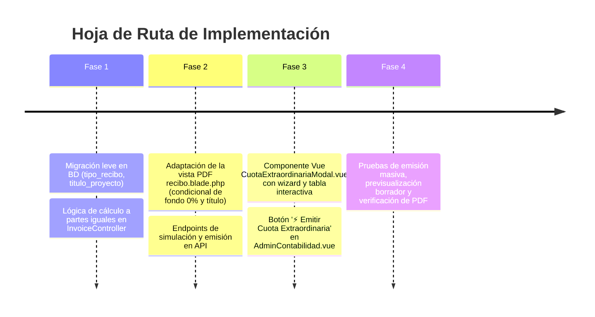

# Propuesta de Arquitectura y Experiencia de Usuario (UX/UI)
## Módulo de Recibos de Cuotas Extraordinarias a Partes Iguales

---

### 1. Resumen Ejecutivo y Objetivo

El objetivo de esta propuesta es dotar al sistema de una funcionalidad robusta, transparente e intuitiva para la **emisión de Recibos de Cuota Extraordinaria**, permitiendo al Administrador del Condominio:
1. Distribuir un monto global a **partes iguales** entre los propietarios (o fijar un monto uniforme por unidad), con posibilidad de ajustar casos particulares si la asamblea lo estipula.
2. Desglosar con claridad técnica y presupuestaria los **conceptos y gastos extraordinarios** (ej. reparación de ascensores, compra de bombas de agua, pintura de áreas comunes, etc.).
3. **Excluir de forma estricta el 10% de Fondo de Reserva**, ya que los gastos extraordinarios no constituyen expensas ordinarias del mes.
4. Generar **recibos individuales para cada propietario en formato PDF profesional** (análogos a los recibos del mes pero adaptados institucionalmente para cuotas especiales) y un **recibo general del proyecto**.
5. Ofrecer la mejor **experiencia de usuario (UX/UI)** mediante un modal dedicado, previsualización en tiempo real, simulación antes de emitir y flujo seguro de Borrador $\rightarrow$ Certificación.

---

### 2. Análisis UX: ¿Botón Específico o Adecuar el Modal Existente?

| Criterio | Opción A: Adecuar el Modal Existente ("Preparar Recibo del Mes") | Opción B (Recomendada): Botón Específico ("⚡ Emitir Cuota Extraordinaria") |
| :--- | :--- | :--- |
| **Claridad Mental** | ⚠️ **Media-Baja**: Mezclar gastos fijos del mes con proyectos extraordinarios suele inducir a error (ej. olvidar apagar el fondo de reserva o confundir alícuotas con partes iguales). |  **Excelente**: Flujo mental 100% enfocado en el proyecto extraordinario sin ruido de conceptos fijos ni alícuotas complejas. |
| **Regla de Negocio** | ⚠️ Requiere toggle `[x] Es Cuota Extraordinaria` que oculte/deshabilite campos condicionalmente. |  Carga directamente la lógica de partes iguales, desactiva el fondo de reserva por defecto y adapta los textos. |
| **Control de Propietarios** | ⚠️ Complejo si en un mismo formulario se mezclan cobros por alícuota con cobros fijos por igual. |  Permite tabla interactiva de propietarios con montos por unidad, exoneraciones y adiciones directas. |
| **Mantenimiento y Estabilidad** | ⚠️ Alto riesgo de afectar el recibo ordinario mensual ya probado y certificado. |  Mantiene el código desacoplado y seguro, reutilizando los componentes de cálculo sin romper el flujo ordinario. |

> **Conclusión UX**: Se propone implementar un **botón de acción rápida dedicado** (`⚡ Emitir Cuota Extraordinaria`) con su propio modal optimizado tipo *Wizard/Asistente*, manteniendo coherencia visual con el resto del panel de Contabilidad.

---

### 3. Experiencia de Usuario (UX/UI Paso a Paso)


---

#### 3.1. Acceso en la Interfaz (`AdminContabilidad.vue`)

En la cabecera superior y en la pestaña de **Recibos y Certificación**:
- Junto al botón primario `[ + Preparar Recibo del Mes ]`, se ubica el botón secundario de alto impacto visual:
  - **Botón:** `[ ⚡ Emitir Cuota Extraordinaria ]` (Color púrpura / violeta profesional o ámbar dorado con elevación suave y microinteracción hover).

```
+----------------------------------------------------------------------------------------------------+
| 🏢 Contabilidad del Condominio                                                                     |
| Libro Mayor, Estado de Resultados, Catálogo de Gastos y Emisión de Recibos                         |
|                                                                                                    |
| [ ⚡ Emitir Cuota Extraordinaria ]  [ ➕ Preparar Recibo del Mes ]                                 |
+----------------------------------------------------------------------------------------------------+
```

---

#### 3.2. Estructura del Modal Asistente (Paso a Paso)

El modal se diseña en 3 secciones organizadas con pestañas fluidas o pasos guiados:

##### 📋 Paso 1: Información del Proyecto Extraordinario
- **Título o Motivo de la Cuota**: Ej. *"Reparación Mayor Bomba Principal de Agua"* o *"Impermeabilización Edificio - Etapa 1"*.
- **Identificador de Período / Cuota**: Ej. `EXT-2026-08` o `Cuota Extraordinaria #1 - 2026`.
- **Fecha de Emisión y Vencimiento**: Selector de fechas (por defecto emisión hoy, vencimiento en 5 o 10 días continuos).
- **Tasa Oficial BCV (Solo Lectura)**: El sistema toma de forma automática e inalterable la tasa oficial activa más reciente fijada en la plataforma por el Super Administrador (Master). Se muestra en modo informativo con un indicador visual de seguridad para evitar discrepancias cambiarias.

---

##### 💰 Paso 2: Conceptos del Gasto y Modalidad de Distribución
El administrador puede elegir entre dos modalidades intuitivas con cálculo automático:

1. **Modo "Monto Total del Proyecto $\div$ Apartamentos"**:
   - El admin ingresa los ítems del presupuesto del proyecto:
     - *Ítem 1:* Compra de Bomba 7.5 HP $\rightarrow$ `$850.00 USD`
     - *Ítem 2:* Tuberías, válvulas de retención y codos $\rightarrow$ `$250.00 USD`
     - *Ítem 3:* Mano de obra técnica y soldadura $\rightarrow$ `$400.00 USD`
   - **Total Proyecto:** `$1,500.00 USD`
   - **Apartamentos a facturar:** 30 unidades
   - **Cálculo en vivo:** `$1,500.00 / 30 = $50.00 USD por propietario`

2. **Modo "Monto Fijo Directo por Propietario"**:
   - El admin define directamente: `$50.00 USD por propietario`.
   - El sistema calcula el total del edificio: `$50.00 × 30 = $1,500.00 USD`.

> [!IMPORTANT]
> **Regla de Fondo de Reserva (0%):**
> En este modal se muestra un distintivo visual permanente:
> 🛡️ **Exención de Fondo de Reserva Activa:** *Este documento es de naturaleza extraordinaria. No se aplicará el 10% de Fondo de Reserva ni recargos ordinarios.*

---

##### 👥 Paso 3: Matriz de Propietarios y Personalización de Cobro (Flexibilidad Total)
El administrador ve una tabla interactiva con todos los apartamentos ocupados del edificio:

| Apto | Propietario | Cuota Base ($) | Ajuste / Exoneración | Total a Cobrar ($) | Total en Bs. (BCV) | Acciones |
| :--- | :--- | :--- | :--- | :--- | :--- | :--- |
| **PB-A** | Juan Pérez | $50.00 | $0.00 | **$50.00** | Bs. 1,825.00 | Activo |
| **1-A** | María García | $50.00 | -$50.00 *(Exonerado Asamblea)* | **$0.00** | Bs. 0.00 | Exonerado |
| **2-B** | Carlos Arocha | $50.00 | +$25.00 *(Recargo 2do puesto)* | **$75.00** | Bs. 2,737.50 | Ajustado |

*Características de la tabla:*
- **Switch "Excluir / Exonerar"** por apartamento (útil si algún apartamento no participa del proyecto por decisión de asamblea o si la conserjería está exenta).
- **Campo de ajuste manual** por apartamento para casos especiales con campo de motivo/nota.
- Resumen en tiempo real: *Total a recaudar: $1,475.00 USD (29 apartamentos activos)*.

---

##### 🔍 Paso 4: Previsualización y Emisión en Borrador
- Botón **"Generar Recibos en Borrador"**:
  - Emite la cuota extraordinaria en estado `Borrador`.
  - Permite descargar el **PDF de prueba con marca de agua "BORRADOR"**.
  - Permite al Administrador revisar con la Junta de Condominio antes del envío masivo.
- Botón **"Certificar y Bloquear Cuota Extraordinaria"**:
  - Congela los montos y emite los números correlativos oficiales (`CE-2026-0001`, etc.).
  - Habilita el envío automático por correo electrónico con PDF adjunto.

---

#### 3.3. Función Extra de Productividad: Compendio de Recibos en un Solo PDF 📄
En la ventana/modal de **"Recibos de Cobro por Propietario e Inmueble"** (tanto para Cuotas Extraordinarias como para Recibos del Mes), se incorpora en la barra de herramientas superior el botón:

👉 **`[ 📄 Descargar Todos los Recibos en un Solo PDF ]`** / **`[ 🖨️ Libro Completo de Recibos ]`**

- **Comportamiento Inteligente según el Estado:**
  - **En Estado Borrador:** Genera un único PDF concatenado con el recibo de cada apartamento (1 página por inmueble) con su correspondiente marca de agua **"BORRADOR - NO VÁLIDO PARA COBRO"**. Permite al administrador revisar físicamente o en una sola pantalla todos los recibos antes de certificar.
  - **En Estado Certificado:** Genera el lote oficial con todos los recibos definitivos listos para imprimir en masa en la oficina de administración o archivar en formato digital.
- **Ventajas de Experiencia de Usuario:**
  - Evita tener que abrir y descargar 20, 50 o 100 archivos PDF de forma individual.
  - Generación de alta velocidad en el servidor mediante paginación fluida en DomPDF (`page-break-after: always`).

---

### 4. Adaptación del Formato del Recibo PDF (`pdf/recibo.blade.php`)

El diseño actual del recibo del mes ya es moderno y profesional. Para las **Cuotas Extraordinarias** se adapta elegantemente la misma plantilla mediante una variable condicional `$tipo_recibo === 'extraordinario'`:

```
+----------------------------------------------------------------------------------------------------+
| CONDOMINIO RESIDENCIAS EL BOSQUE                     [ AVISO DE COBRO - CUOTA EXTRAORDINARIA ]     |
| RIF: J-30057653-1 | Caracas, Venezuela               N°: CE-2026-00042                             |
|                                                      Emisión: 15/08/2026 | Vence: 25/08/2026       |
+----------------------------------------------------------------------------------------------------+
| INMUEBLE: Apto 4-B          | PROPIETARIO: CARLOS AROCHA         | DISTRIBUCIÓN:                   |
| Piso 4 - Torre A            | C.I.: V-14.521.890                 | ⚖️ Partes Iguales (1 / 30)      |
+----------------------------------------------------------------------------------------------------+
| PROYECTO: REPARACIÓN Y SUSTITUCIÓN DE BOMBA HIDRONEUMÁTICA #2                                      |
+----+---------------------------------------------------------------+---------------+---------------+
| #  | Descripción del Concepto Extraordinario                       | Total Edif. $ | Cuota Apto $  |
+----+---------------------------------------------------------------+---------------+---------------+
| 1  | Adquisición de Bomba Sumergible 7.5 HP Trifásica Marca Pedrollo | $     850,00  | $      28,33  |
| 2  | Válvulas de retención 2" de bronce, presscontrol y manómetros | $     250,00  | $       8,33  |
| 3  | Mano de obra técnica de instalación, cableado y pruebas       | $     400,00  | $      13,34  |
+----+---------------------------------------------------------------+---------------+---------------+
|    | TOTAL GASTOS EXTRAORDINARIOS DEL PROYECTO:                    | $   1.500,00  | $      50,00  |
+----+---------------------------------------------------------------+---------------+---------------+
| CANALES DE PAGO:                            | RESUMEN DE LIQUIDACIÓN DE LA CUOTA                   |
| • BNC Cta Cte: 0191-0514-8221-0001-8351     | Subtotal Conceptos Extraordinarios:     $ 50,00 USD  |
| • Pago Móvil BNC: 0414-1234567 | J-300576531| Aporte Fondo de Reserva:                 NO APLICA   |
| • Depósito Divisas USD: Cta 0191-0012-0223  | ---------------------------------------------------  |
|                                             | TOTAL CUOTA EXTRAORDINARIA:             $ 50,00 USD  |
|                                             | Tasa Oficial BCV:                       Bs. 36,50    |
|                                             | TOTAL A PAGAR EN BOLÍVARES:             Bs. 1.825,00 |
+----------------------------------------------------------------------------------------------------+
```

#### Diferencias clave en el PDF frente al Recibo del Mes:
1. **Encabezado**: Título destacado en azul marino o púrpura institucional: **`AVISO DE COBRO - CUOTA EXTRAORDINARIA`**.
2. **Caja de Alícuotas**: Se sustituye el porcentaje de alícuota por el distintivo **`⚖️ Cuota a Partes Iguales (1 de N)`** o el porcentaje proporcional.
3. **Fondo de Reserva**: Se elimina el recuadro de cálculo del 10% del fondo de reserva. En el resumen de liquidación se indica explícitamente **`Fondo de Reserva: No aplica (Gasto Extraordinario)`** o simplemente no se suma al total.
4. **Resumen de Liquidación**: El total es exactamente igual al subtotal de los ítems de la cuota extraordinaria.

---

### 5. Arquitectura Técnica y Modelo de Datos (Backend Laravel)

#### 5.1. Esquema de Base de Datos (`invoices`)
Se aprovecha la tabla `invoices` existente sin romper compatibilidad, utilizando o agregando las siguientes columnas:

```php
// En la tabla 'invoices':
$table->string('tipo_recibo')->default('ordinario'); // 'ordinario' | 'extraordinario'
$table->string('titulo_proyecto')->nullable();       // Ej: 'Reparación de Bomba de Agua'
$table->string('modalidad_calculo')->default('partes_iguales'); // 'alicuota' | 'partes_iguales' | 'monto_fijo'
```

- **`detalles_gastos` (JSON):** Almacena el desglose de los conceptos extraordinarios con el monto total del edificio y el monto individual correspondiente a ese apartamento.
- **`fondos` (JSON):** Se guarda con valor de aporte `$0.00` para garantizar integridad en reportes contables:
  ```json
  {
    "nombre": "FONDO DE RESERVA",
    "acumulado": 2997.06,
    "monto_mes": 0.00,
    "monto_alicuota": 0.00,
    "aplica": false
  }
  ```
- **`numero_factura`**: Formato estructurado `CE-{AÑO}{MES}-{ID_APTO}` (ej. `CE-202608-012`) para diferenciarlo de las facturas ordinarias `RI-202608-012`.

---

#### 5.2. Nuevos Endpoints en la API (`routes/api.php`)

| Método | Endpoint | Controlador | Descripción |
| :--- | :--- | :--- | :--- |
| `POST` | `/api/v1/invoices/cuota-extraordinaria/simular` | `InvoiceController@simularCuotaExtraordinaria` | Calcula en memoria la repartición a partes iguales y devuelve el desglose por propietario antes de guardar. |
| `POST` | `/api/v1/invoices/cuota-extraordinaria/generar` | `InvoiceController@generarCuotaExtraordinaria` | Genera los recibos individuales en lote (estado Borrador o Certificado). |
| `GET` | `/api/v1/reportes/recibos-lote-pdf` | `ReporteController@recibosLotePdf` | **Compendio Consolidado:** Genera en un solo PDF todos los recibos individuales de los propietarios (con marca Borrador o Certificado según el estado). |
| `GET` | `/api/v1/reportes/cuota-extraordinaria-general` | `ReporteController@cuotaExtraordinariaGeneralPdf` | Descarga el PDF consolidado del proyecto extraordinario para la cartelera / asamblea. |

---

### 6. Experiencia en el Portal del Propietario

Cuando el propietario ingresa a su sesión web o móvil:
1. **Separación Visual de Obligaciones**:
   - Tarjeta 1: `Recibo del Mes (Expensas Ordinarias)` $\rightarrow$ `$42.50 USD / Bs. 1.551,25`
   - Tarjeta 2: `⚡ Cuota Extraordinaria: Reparación de Bomba` $\rightarrow$ `$50.00 USD / Bs. 1.825,00`
2. **Reporte de Pago Selectivo o Combinado**:
   - El propietario puede reportar el pago de la cuota extraordinaria de forma independiente (ej. transferencia específica con su número de referencia bancaria) o pagar ambas deudas juntas.
3. **Comprobante de Pago y Paz y Salvo**:
   - Al ser aprobado por el administrador, el sistema emite el **Recibo de Pago (RP)** correspondiente indicando la cancelación de la cuota extraordinaria.

---

### 7. Plan de Implementación Recomendado



---

### 8. Resumen de Ventajas de la Propuesta

1. **Cero impacto negativo en lo existente**: No altera el recibo mensual que ya funciona a la perfección.
2. **Cumplimiento legal y financiero**: Excluye el fondo de reserva de manera transparente y fundamentada en la Ley de Propiedad Horizontal.
3. **Flexibilidad total para el Administrador**: Permite repartir equitativamente en 1 clic y además editar montos particulares o exoneraciones aprobadas en asamblea.
4. **Experiencia de Usuario de Primer Nivel**: Interfaz fluida, cálculos en tiempo real en USD y Bs. BCV, asistente paso a paso y vista previa sin errores.

---
*Documento elaborado para el Sistema de Gestión de Condominios AZPRO.*
